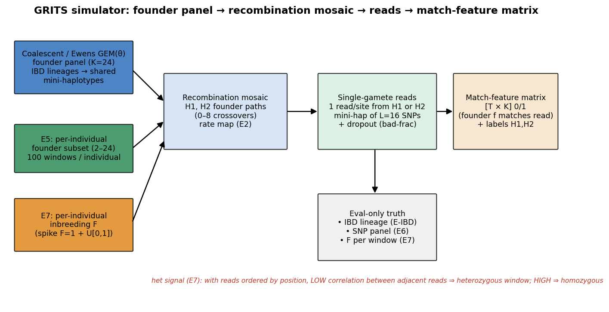
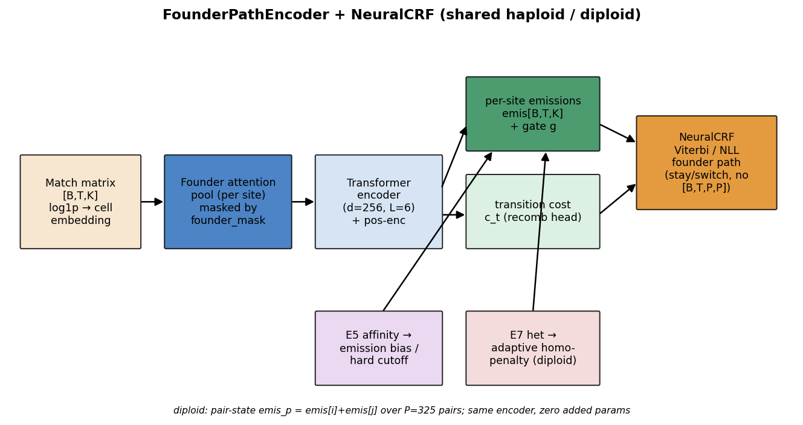
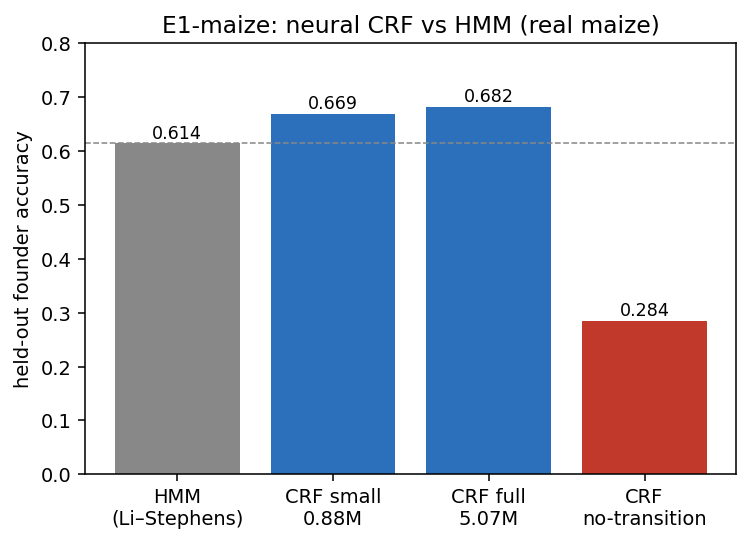
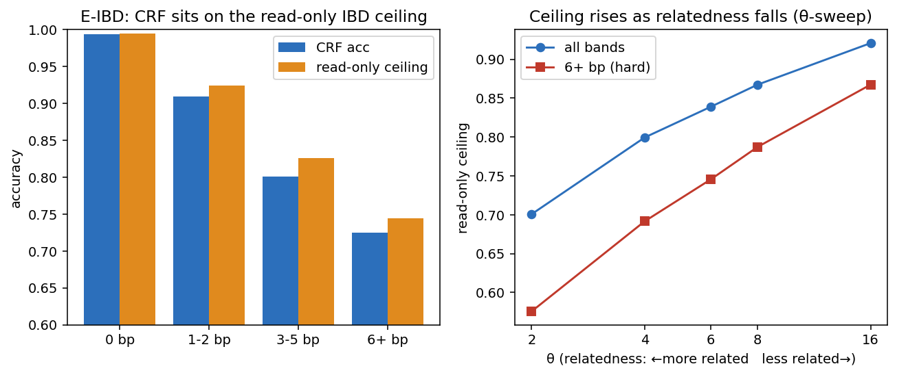
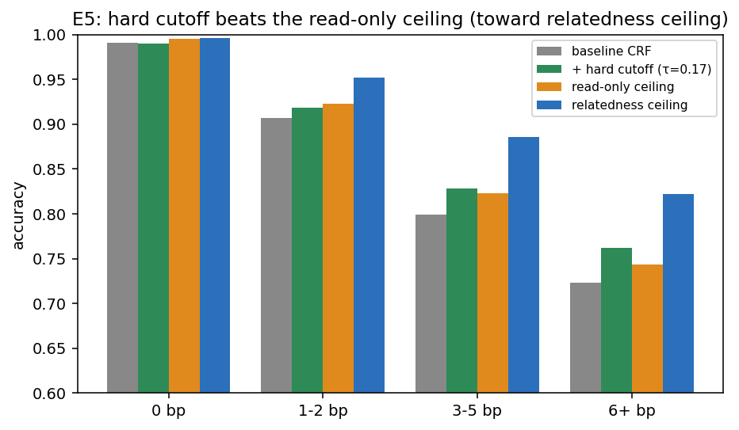
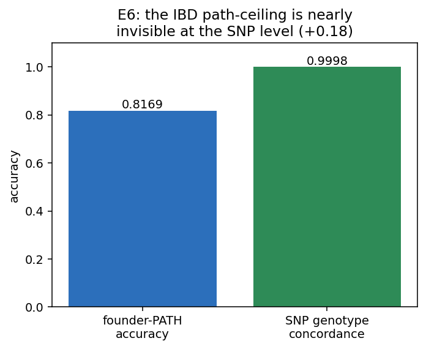
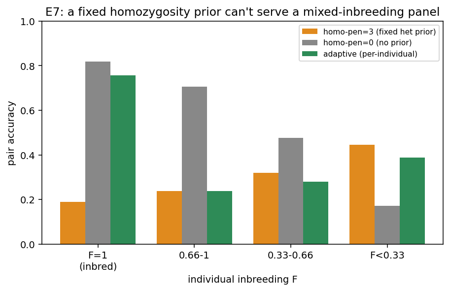

# GRITS-CRF — Project Report

A neural conditional random field (CRF) for imputing **founder haplotype paths** in
diploid plant genomes, and a synthetic testbed that makes the problem well-posed
and its information limits computable. This report summarises the simulator, the
model, and the experiment series E1–E8. Full per-experiment detail is in
[`RESULTS.md`](RESULTS.md); the plan is in [`PLAN.md`](PLAN.md). Figures are
regenerated by `src/python/crf/figures.py`.

---

## 1. Problem

Each sample's genome is a recombination **mosaic** of `K` founder haplotypes.
Observed only through noisy, low-coverage allele-match patterns, the task is to
recover, per site, which founder the sample descends from — the *founder path*.
GRITS neuralises the classical Li–Stephens HMM: a shared encoder produces per-site
founder **emissions** and a per-site **transition cost** `c_t`, and a `NeuralCRF`
decodes the maximum-likelihood path (Viterbi) without ever materialising the
`[B,T,P,P]` diploid transition tensor.

---

## 2. Simulator

A coalescent / Ewens-GEM(θ) model builds the founder panel: founders are mosaics of
ancestral lineages, so founders on the same lineage over a block are
**identical-by-descent (IBD)** and share mini-haplotypes. θ is a *relatedness dial*
— low θ ⇒ few lineages ⇒ much IBD sharing; high θ ⇒ singleton-dominated, little
sharing. From this panel:

- **Recombination mosaic:** H1/H2 founder paths with 0–8 crossovers (optionally a
  hidden variable rate map, E2).
- **E5 grouping:** windows are grouped into *individuals*, each descending from a
  per-individual subset of 2–24 founders (100 windows/individual).
- **E7 inbreeding:** a per-individual inbreeding coefficient F (a spike at F=1 for
  inbred lines plus U[0,1]) sets how often H1≡H2.
- **Reads:** one read per site sampled from a random gamete (H1 or H2), each a
  mini-haplotype of L=16 SNPs, with tract dropout. The model sees only the
  resulting `[T×K]` 0/1 **match-feature matrix** plus the founder labels.
- **Eval-only truth** (never an input): per-site IBD lineage (E-IBD), the
  founder×SNP allele panel (E6), and per-window F (E7).

A key downstream property: with reads ordered by position and gametes evenly mixed,
**low correlation between adjacent reads signals a heterozygous window, high
correlation a homozygous one** — the het signal E7 exploits.

---

## 3. Model architecture

The `FounderPathEncoder` embeds the match matrix per cell, pools founders by
attention (masked by `founder_mask`), runs a Transformer (d=256, L=6), and emits
per-site founder **emissions** + a **gate** and a per-site **transition cost**
`c_t`. The `NeuralCRF` decodes with a matrix-free stay/switch recursion. The same
encoder serves the **diploid** pair-state model (P=325 founder pairs,
`emis_p = emis[i]+emis[j]`) with zero added parameters. Two conditioning hooks were
added on this branch: the **E5** relatedness affinity (emission bias / hard cutoff)
and the **E7** het-derived adaptive homozygous penalty.

---

## 4. Experiments

### E1 — Neural CRF vs HMM (real maize)

On real maize (held-out founder accuracy), the CRF beats the Li–Stephens HMM by
**+6.7** (0.682 vs 0.614); even a 0.88M model beats it (+5.5). The win is entirely
in low-recombination windows; the HMM over-segments (~4× too many breakpoints). The
no-transition ablation (0.284) confirms the CRF prior is doing the work.

### E-IBD — Is 60–80% the information ceiling?

In hard (high-recombination) windows the haploid CRF tops out at 60–80%. We show
this is an **information ceiling**, not a model failure: the true founder is IBD
with others over the block, so their reads are bit-identical and no read-only
decoder can separate them. The CRF sits within **≤2.6 pts** of the computed ceiling
in every band, and **86–100%** of its errors are provably IBD-confusable. The
ceiling rises predictably as relatedness falls (θ-sweep: all-band 0.70→0.92).
The only lever above it is *outside information* — motivating E5.

### E5 — Relatedness breaks the ceiling (hard cutoff)

Per individual we estimate a genome-wide founder **affinity** (each founder's match
rate over its 100 windows; reads only). Conditioning the *encoder* on it failed
(bf16-unstable or flat). But the affinity separates present vs absent founders at
**AUC 0.969**, so a **decode-time hard cutoff** — mask absent founders, then Viterbi
— works on the stable baseline with no retraining. At τ=0.17 it **exceeds the
read-only ceiling**: all-band 0.819→0.844, and +3.9 pts in the hard 6+bp band
(0.724→0.762, above the 0.744 ceiling), at 0.45% true-founder exclusion. The
maximum recoverable headroom (relatedness ceiling) is +5.2 pts overall.

### E6 — SNP-level accuracy: the IBD ceiling is invisible at the SNP

Composing the decoded path with the founder×SNP panel gives genotypes. Founder-PATH
accuracy 0.817 but **SNP genotype concordance 0.9998** (+0.18): path errors land on
read-identical (IBD-confusable) founders, whose SNP alleles match the truth, so the
genotype call is still right. GRITS is strong on the metric the field uses
*because* its residual path errors are between sequence-identical founders. (A
Beagle-comparable MAF-stratified dosage r² needs a fixed SNP-panel sim — a
follow-up.)

### E7 — Mixed-inbreeding panel: the prior must be per-individual

A single-read diploid emission collapses to homozygous, so a het prior
(`homo_penalty`) is needed — but on a mixed-inbreeding panel a *fixed* prior cannot
serve both: `homo_penalty=3` cripples the inbred half (0.19 pair-acc, whose correct
answer is homozygous) while helping the outbred; `homo_penalty=0` flips it. The
het signal (adjacent-read correlation) estimates each individual's F from reads
alone (**corr −0.99** with true F), enabling a **per-individual adaptive penalty**
(0 for inbred, full for outbred). Once trained with the E8 stability recipe (cosine
-decay + spike-skip, ported to the diploid CRF), the adaptive model reaches the goal
no fixed prior can: **outbred pair-accuracy 0.445 — equal to the best fixed prior —
while simultaneously holding inbred at 0.784** (any fixed prior that wins one craters
the other). Intermediate-F buckets still trail and the diploid tail still needs care
(proxy→penalty calibration; encoder-side conditioning), but the per-individual prior
is now validated end-to-end.

### E8 — Inference speed and 1M-window scale

**Speed:** profiling the encoder forward vs the Viterbi decode separately shows the
**decode dominates** — at T=4096 Viterbi is **80%** of latency, the Transformer
encoder only 20%. The encoder grows sub-quadratically (the founder pool is over K,
not T), Viterbi is linear in T, memory is linear (~4.3 GB at T=4096), throughput a
flat ~450k sites/s. **Mamba2 is therefore not the priority** — the long-context
encoder swap targeted a length/memory bottleneck that does not exist here; the win is
a batched/fused Viterbi, not the encoder.

**1M-window scale:** the full-data headline run (1,000,000 windows = 10,000
individuals, θ=6) converges to **0.823 all-band founder accuracy**, sitting **≤1.9 pts
below the computed information ceiling in every difficulty band**, with **91% of all
residual errors provably IBD-confusable** — the E-IBD ceiling argument is *stronger*
at scale, since convergence pushes nearly all error mass onto IBD confusion. The E5
relatedness cutoff (τ=0.17) replicates exactly: it lifts all-band accuracy **onto the
read-only ceiling** (0.823→0.840) and the hard 6+bp band **past it** (0.725→0.754) at
<1% true-founder exclusion. One honest caveat: at 1M scale training is **non-monotonic**
— an epoch-scale limit cycle in which the model reaches the ~0.82 basin then a large
late-epoch step kicks it back out to degenerate weights. Five runs show this is *not* a
bf16-partition-precision problem (an fp32 partition does not fix it, and at high lr makes
it worse); it is driven by the **constant learning rate**. A **warmup + cosine-decay-to-0**
schedule holds the basin for three consecutive epochs (the partial fix now in
`--cosine-decay`); a residual rare gradient spike remains, addressable by a loss-spike
step-skip. Today's recipe: cosine-decay + checkpoint-on-best-val.

---

## 5. Conclusions

1. The neural CRF beats the HMM and is **at the information ceiling** on hard
   windows — the residual error is IBD confusion, not model weakness.
2. That ceiling is broken only with **outside information**; a decode-time
   relatedness cutoff does it cleanly (E5).
3. The path-ceiling errors are **nearly free at the SNP level** (E6), so GRITS is
   competitive on standard imputation metrics.
4. Serving **mixed-inbreeding** panels needs per-individual priors estimated from
   the reads, not fixed hyperparameters (E7).

**Open:** adaptive-prior stability (E7), a fixed-SNP-panel benchmark (E6 follow-up),
**fully-monotonic 1M-scale training** (E8 — cosine-decay holds the basin; a loss-spike
step-skip should close the residual spike. The decode bottleneck is settled and Mamba2
is not needed), and promotion to real diploid maize.
